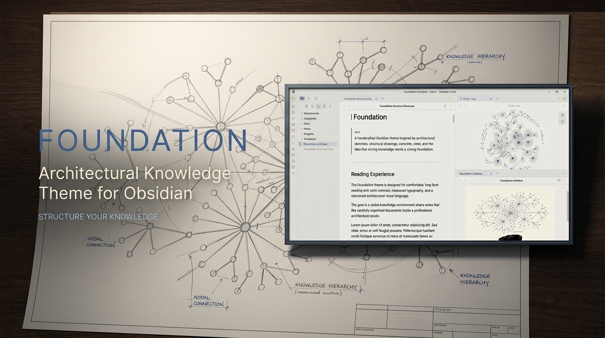
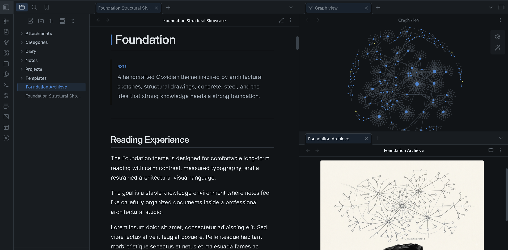
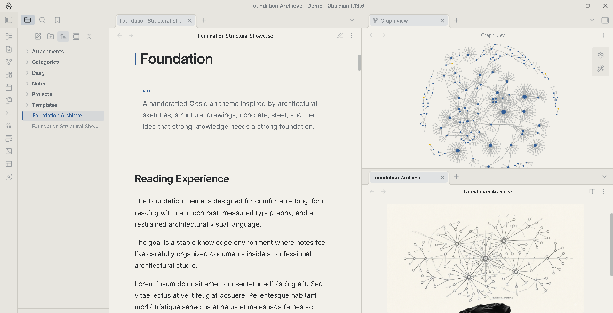
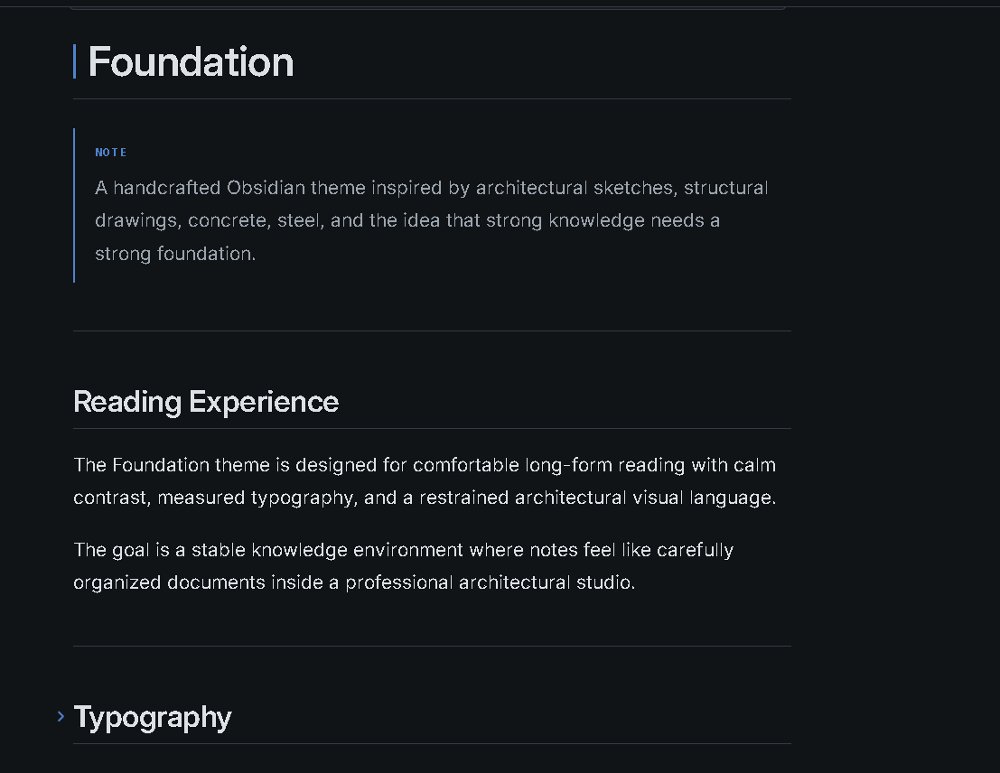
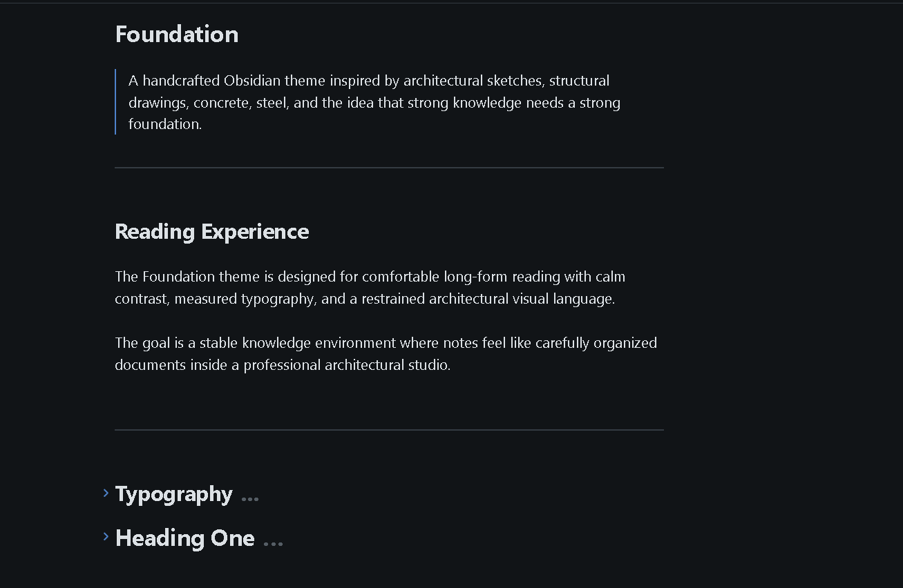
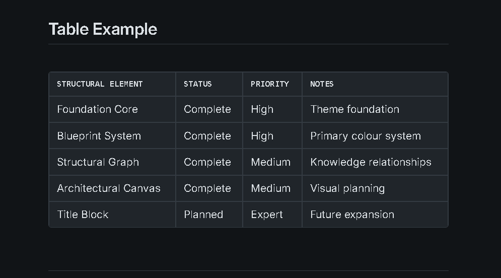
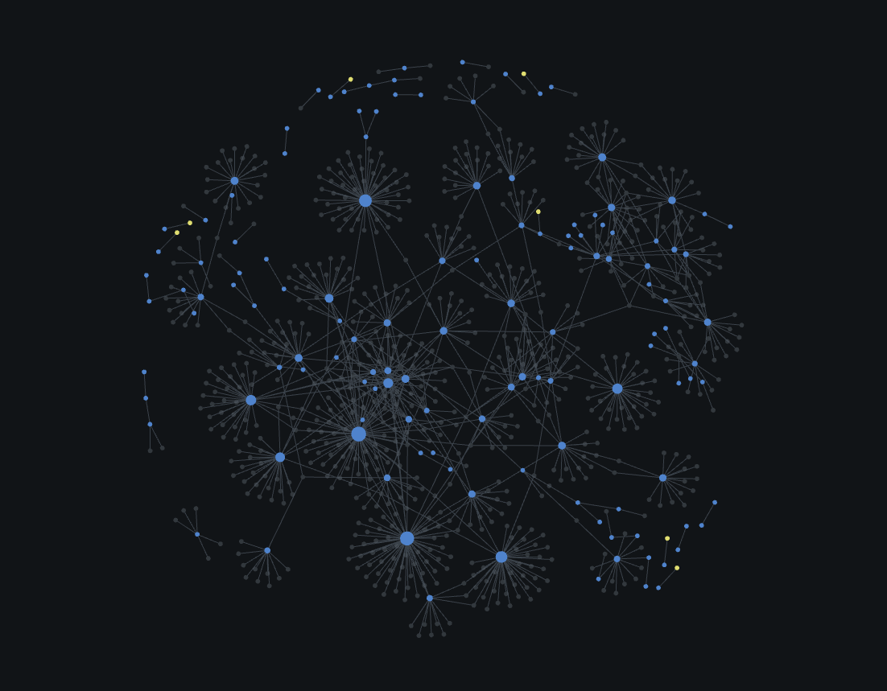
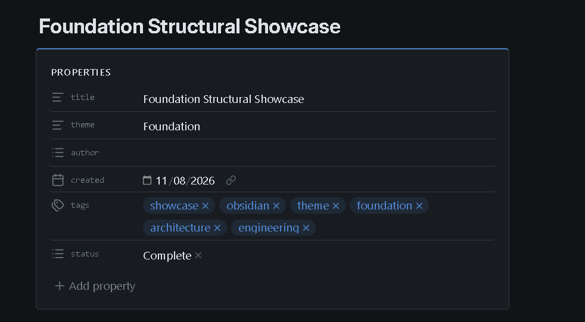
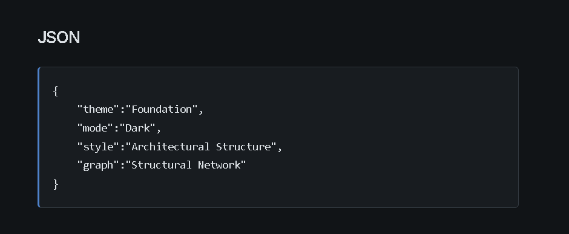
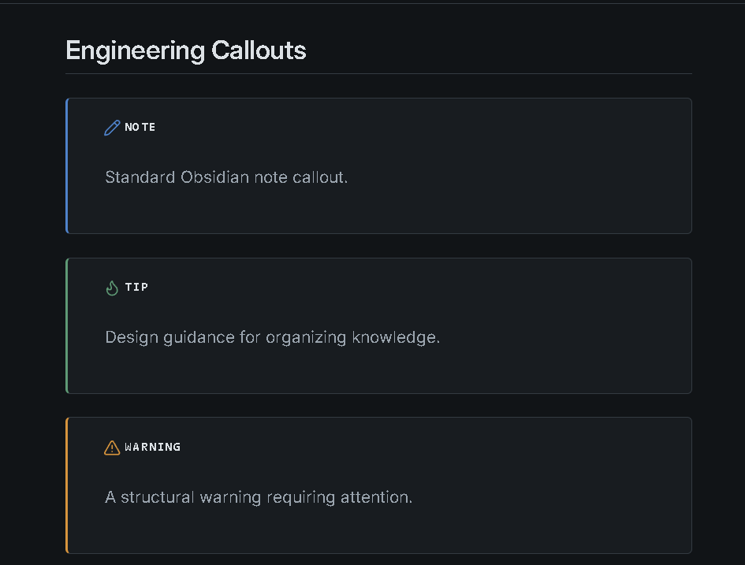

# Foundation


**A structural, architectural Obsidian theme inspired by foundation drawings, architectural sketches, concrete, steel, blueprint lines, and the discipline of building strong systems.**

Foundation turns your vault into a structured knowledge environment — where notes become rooms, links become structural connections, properties become specifications, and knowledge grows from a solid foundation.

Designed for **researchers, engineers, architects, developers, students, writers, planners, and anyone who works with complex information and structured ideas.**

---

## Preview



> **Where strong knowledge starts with a foundation.**

---

## Screenshots

### Dark Mode



A structural night workspace with deep concrete surfaces, steel tones, and controlled blueprint-blue accents designed for focused work and extended sessions.

### Light Mode



A warm architectural studio inspired by drafting paper, concrete, steel, and natural daylight.

### Reading Mode



A calm, comfortable reading environment for research, documentation, technical notes, and long-form writing.

### Source Mode



A precise editing workspace designed for Markdown, documentation, configuration, and structured writing.

### Tables



Structured data presentation inspired by engineering schedules and architectural specifications.

### Graph View



A structural knowledge network where notes become elements and relationships become connections within the larger knowledge system.

### Properties



A technical specification-style presentation for organizing metadata, classifications, project information, and document details.

### Code



A focused technical environment with restrained surfaces and readable developer-friendly typography.

### Callouts



Engineering-style information panels for specifications, design notes, warnings, verification, references, and important information.

---

## Features

| Feature | Description |
|---|---|
| 🏗️ Dark Mode | Structural night workspace with concrete and steel surfaces |
| 📐 Light Mode | Warm architectural drafting environment |
| 📖 Reading Mode | Focused long-form reading |
| ✍️ Source Mode | Precise Markdown editing |
| 🧱 Foundation System | Interface inspired by architecture and structural design |
| 🔵 Blueprint Accents | Controlled blueprint-blue highlights |
| 🟠 Construction Accents | Restrained amber for warnings and secondary emphasis |
| 🔗 Structural Links | Links represent connections between ideas |
| 📊 Tables | Engineering-style structured data presentation |
| 💻 Code Blocks | Focused technical documentation surfaces |
| 🗂 Properties | Specification-style metadata styling |
| 🕸 Graph View | Structural knowledge network |
| 🏷 Tags | Compact technical classification labels |
| ☑ Tasks | Clear work-order style task states |
| 📋 Callouts | Engineering documentation-inspired callouts |
| 📐 Canvas | Architectural drafting-board aesthetic |
| 📱 Mobile | Responsive mobile interface |

---

## Built for Structured Thinkers

Foundation is especially suited for:

- 🏗️ Civil & Structural Engineers
- 📐 Architects & Designers
- 💻 Software Engineers
- 🔬 Researchers & Scientists
- 🧪 Engineering Students
- 🖥️ Developers
- 📚 Technical Writers
- 📋 Project Planners
- 🧠 Knowledge Management
- 📝 Researchers & Long-form Writers
- 🛠️ Makers & System Designers

Foundation is not limited to engineering. It is designed for anyone who thinks in **structures, systems, relationships, processes, hierarchy, and organized information**.

---

## Design Philosophy

Foundation is built around the idea that a knowledge vault behaves like a building.

- **Notes** become rooms.
- **Folders** become floors or sections.
- **Links** become structural connections.
- **Tags** become classifications.
- **Properties** become specifications.
- **Tasks** become work orders.
- **Graph View** becomes a structural plan.
- **Canvas** becomes an architectural drawing board.
- **Code** becomes the technical layer.
- **Callouts** become engineering annotations.

The goal is not to make Obsidian look like a construction site.

Instead, Foundation uses the **visual language of architecture and structural engineering** to make information feel stable, organized, deliberate, and connected.

> **Structure before decoration.**

---

## Architectural Sketch Language

Foundation takes subtle inspiration from the visual language of architectural drawings and engineering sketches:

```text
        ┌───────────────┐
        │   KNOWLEDGE   │
        │               │
        │  ┌─────────┐  │
        │  │  NOTES  │──┼────┐
        │  └────┬────┘  │    │
        │       │       │    │
        │  ┌────┴────┐  │    │
        │  │STRUCTURE│──┼────┘
        │  └────┬────┘  │
        │       │       │
        └───────┼───────┘
                │
        ───── FOUNDATION ─────
```

The sketch language remains subtle rather than turning the interface into a literal blueprint.

---

## Typography

- **Body:** IBM Plex Sans
- **Headings:** IBM Plex Sans
- **Technical:** IBM Plex Mono

Typography is designed to feel **precise, professional, architectural, and highly readable** without becoming overly industrial.

---

## Installation

1. Download the repository.
2. Copy the theme folder to:

```text
YourVault/.obsidian/themes/
```

3. Open **Obsidian → Settings → Appearance**.
4. Select **Foundation**.

---

## Compatibility

| Feature | Status |
|---|---|
| Desktop | ✅ |
| Mobile | ✅ |
| Reading Mode | ✅ |
| Live Preview | ✅ |
| Graph View | ✅ |
| Properties | ✅ |
| Tables | ✅ |
| Callouts | ✅ |
| Code Blocks | ✅ |
| Dataview | ✅ |
| Tasks | ✅ |
| Canvas | ✅ |
| Excalidraw | ✅ |

---

## Support ☕

If you enjoy Foundation and want to support development:

<a href="https://www.buymeacoffee.com/CosmicSeaFox" target="_blank">

</a>

<a href="https://ko-fi.com/cosmicseafox" target="_blank">

</a>

---

## Credits

**Fonts**

- IBM Plex Sans
- IBM Plex Mono

Inspired by architectural drafting, structural engineering, technical documentation, and the visual language of construction drawings.

Made for the Obsidian community.

---

## License

MIT License

**Foundation — Strong knowledge needs a strong foundation.**